  

  
  
  

## Profile scan

  

I build machine-learning and security projects and test them on **real public data**.
Every number on this page comes from a held-out evaluation and is documented, with its
data source, in the project's README.

## Proof, not promises

  

   0.17), no crypto surge signal (AUC 0.53)" />

## Selected work

  

| Project | Verified result | Stack | Links |
| --- | --- | --- | --- |
| 🛡️ **Alibi**: who's breaking in, how, and from where | Threat intelligence on a live 3D globe, built only on real public data: 1,020 breaches (16.3B accounts) and how each happened, 8,420 live malware servers, 430 criminal networks, this week's ransomware victims, 1,733 exploited flaws. Its sign-in model catches 14 of 22 account takeovers on 5.4M held-out logins while challenging 0.77% of logins (ROC-AUC 0.978). | FastAPI · scikit-learn · DuckDB · globe.gl | [repo](https://github.com/UtkarshOver9000/alibi) · [demo](https://impossible-travel-auth-anomaly-engi.vercel.app) |
| 🎣 **Phishing URL detection** | Catches 63.2% of phishing domains live on the OpenPhish feed, with 9 false alarms per 10,000 real sites. Includes an audit of this dataset's ~100% URL-format shortcut. | scikit-learn · FastAPI | [repo](https://github.com/UtkarshOver9000/phishvpn-detection) · [demo](https://phishvpn-detection-ochre.vercel.app) |
| 🧩 **Scam Site Detector** | Rule-based browser extension measured on 235,795 real pages: few false alarms, low recall. The numbers are why the phishing model exists. | TypeScript · Chrome extension API | [repo](https://github.com/UtkarshOver9000/scam-site-detector) |
| ⚡ **AETHERGRID Ω** · SIH 2026 | On 84 real Uttar Pradesh households (CEEW smart meters), cuts day-ahead feeder scheduling error by 11.7% against the best naive method. | LightGBM · PuLP · Gymnasium · Streamlit | [repo](https://github.com/UtkarshOver9000/aethergrid-omega) |
| 🏙️ **AETHERGRID World Sim** · SIH 2026 | 24-society electricity district in the browser, with a reality check against real household meter data. | Python · Three.js | [repo](https://github.com/UtkarshOver9000/aethergrid-worldsim) · [3D demo](https://aethergrid-worldsim.vercel.app) |
| 📚 **AI Research Copilot** | Citation-first document Q&A. BM25 tuned on BEIR SciFact reaches nDCG@10 0.663 on held-out claims, nearly double the old LSA retriever (0.348). | FastAPI · Next.js | [repo](https://github.com/UtkarshOver9000/ai-research-copilot) · [demo](https://ai-research-copilot-delta.vercel.app) |
| 📉 **Stock Price Movement Predictor** | 12 US stocks, 104,565 trading days: no model beats a constant guess with statistical significance (every p > 0.17). The repo documents why. | scikit-learn · pandas | [repo](https://github.com/UtkarshOver9000/Stock-price-predictor) · [dashboard](https://gcsrmstockpricepredictor-seven.vercel.app) |
| 🪙 **Crypto Surge Prediction** | 9 years of Binance data, 100 coins: indicators don't predict 7-day +15% surges (ROC-AUC 0.53) and lose to random picks after fees. Modest volatility signal (0.60). | scikit-learn · FastAPI | [repo](https://github.com/UtkarshOver9000/crypto-surge-prediction) |
| 🎓 **F.A.S.T** | Website for the Futuristic AI Society of Tech, an NVIDIA Student Developer Ecosystem community at SRMIST Kattankulathur. | React · Vite · Tailwind | [repo](https://github.com/UtkarshOver9000/F.A.S.T-website) · [site](https://f-a-s-t-website-one.vercel.app) |

## GitHub stats

  

### Contribution graph · ship + eraser

  

## Tech stack

  

## Dev quote of the day

  

---

  I like problems where the honest answer matters more than the impressive one. 
  Open to collaborating on ML, security and energy projects.

  Highlights, projects and stats cards by <a href="https://www.gitskins.com">GitSkins</a> · wordmark, scan, contribution, stack and quote cards built by <a href="scripts/cards.py">scripts/cards.py</a>, live ones refreshed daily

